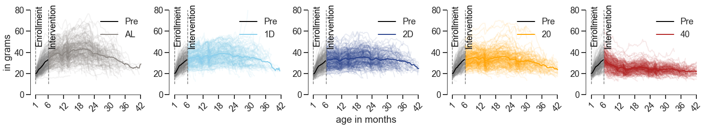

## Dynamics of Body Weight in Diversity Outbred Mice

### Overview
This repository contains a Python implementation for the extraction of homeostatic and adaptive body weight-derived traits in diversity outbred mice subjected to various dietary interventions. To extract traits from the lifespan trajectories of the mice's body weight, an autoregressive hidden Markov model (ARHMM) was developed, resulting in the identification of three latent states: _decline_, _steady_, and _growth_. Based on these latent staes, novel body weight traits were derived and a time-varying Cox proportional hazard model was employed to identify traits associated with lifespan. Genetic mapping of these lifespan-associated traits identified 12 genomic loci, none of which were previously mapped to body weight. 

We kindly request that you cite our work should you find this resource to be useful.

> GV Prateek, Zhenghao Chen, Kevin Wright, Andrea Di Francesco, Vladimir Jojic, Gary A Churchill, and Anil Raj, "Longitudinal analysis of body weight reveals homeostatic and adaptive traits linked to lifespan in diversity outbred mice," bioRxiv 2024.06.13.598774; doi: https://doi.org/10.1101/2024.06.13.598774

### Installation
If you prefer using the default python installation, you can follow the steps below:
```
(base)$ conda create -n env_name python=3.8
(base)$ conda activate env_name
(env_name)$ git clone https://github.com/calico/do_bwd.git
(env_name)$ cd do_bwd
(env_name)$ python setup.py install
```

### Scripts
We provide trained models and processed datasets along with this github repository. However, if you would like to train models from scratch, we provide scripts that can be deployed as SLURM jobs. For more details, please check the description [here](scripts/README.md).

### Notebooks
We also provide sample notebooks to explain our analyses. These notebooks use the processed datasets in the [`data`](data/) folder and generate some of the figures used in the manuscript.

1. [viarhmm.ipynb](notebooks/01_viarhmm.ipynb): ARHMM, model selection, and sample body weight trajectories with an overlay of physiological states.
2. [bw_traits.ipynb](notebooks/02_bw_traits.ipynb): Novel body weight-derived traits including time-interval, pre-post intervention, and adapatation to stress.
3. [lifespan.ipynb](notebooks/03_lifespan.ipynb): Time-varying Cox proportional hazard model to identify traits associated with lifespan.
4. [genetics.ipynb](notebooks/04_genetics.ipynb): Heritability and genetic mapping of lifespan-associated traits.
